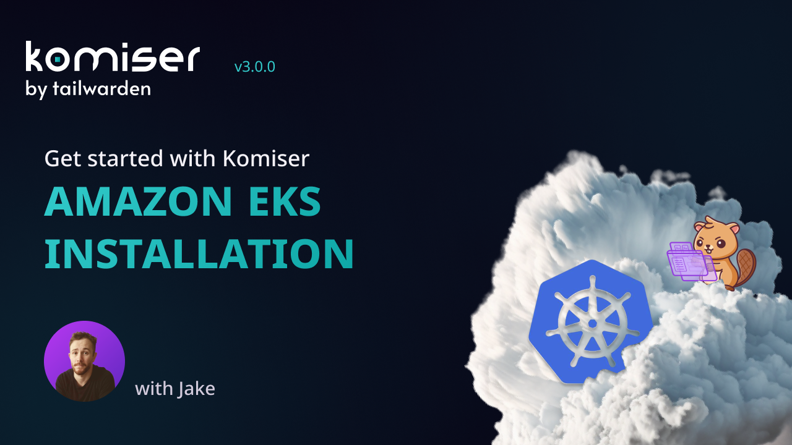

# Komiser


[Komiser](https://www.komiser.io/?utm_source=github&utm_medium=social) is an open-source cloud-agnostic resource manager. It integrates with multiple cloud providers (including AWS, OCI, DigitalOcean, Kubernetes and CIVO), builds a cloud asset inventory, and helps you break down your cost at the resource level 💰

## Introduction

This chart bootstraps a community edition Komiser instance.

## Prerequisites

- Kubernetes 1.6+

# Configuration (single AWS account)

**Enable service accounts to access AWS resources in three steps**

1. **[Create an IAM OIDC provider for your cluster](docs/enable-iam-roles-for-service-accounts.md)** – You only need to do this once for a cluster\.

2. **[Create an IAM role and attach an Komiser IAM policy to it with the permissions that your service accounts need](docs/create-service-account-iam-policy-and-role.md)**

3. Update [templates/service-account.yaml](templates/service-account.yaml) with the IAM role you've created previously.

# Configuration (multiple AWS accounts)

Steps for a container to access the resources in multiple AWS accounts. \
*We are working with two example clusters, **ADMIN** and **DEV** cluster.* 

`Solution diagram`:


**Steps:**
1. **[Create an IAM OIDC provider for your ADMIN cluster](docs/enable-iam-roles-for-service-accounts.md)** 
2. **[Register the ADMIN OIDC provider in the DEV cluster](docs/oidc-target-account.md)** 
3. **[Create an ADMIN IAM role](docs/create-service-account-iam-policy-and-role.md)** 

    – Attach the recomended Komiser [policy](https://github.com/mlabouardy/komiser/blob/master/policy.json) \
    – Create a [Trust Relathionship](docs/create-service-account-iam-policy-and-role.md) with the kubernetes ServiceAccount \
    – Attach an additional [policy](docs/assume-target-account-role.md) to assume the DEV IAM role\.

4. **[CREATE A DEV IAM role](docs/create-service-account-iam-policy-and-role.md)**

    – Add the recomended Komiser [policy](https://github.com/mlabouardy/komiser/blob/master/policy.json) \
    – Create a [Trust Relathionship](docs/trust-relathionship-admin-role.md) with the ADMIN role

5. **[Add the ADMIN role to the ServiceAccount](templates/service-account.yaml)**

6. **[Add a ConfigMap to the `/templates` folder](docs/create-configmap.md)**

7. **[Mount the ConfigMap to the Deployment manifest](docs/mount-cm-to-deployment.md)**

**Tutorial walkthrough:**

[](https://www.youtube.com/embed/4veDmJpui44)

> Note that even though the video covers Amazon EKS, the Helm chart can be deployed to any Kubernetes cluster no matter the provider. 

# Installing the chart
To install the chart:

```bash
$ helm install -f values.yaml komiser .
```

The above command deploys Komiser on the Kubernetes cluster in the default configuration.